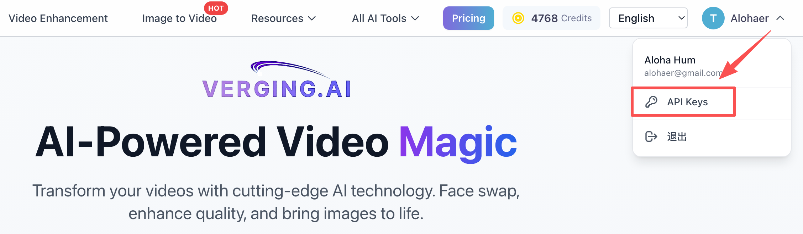

# verging.ai Agent Skills

AI-powered media processing skills for Claude Code.

## Features

### Face Swap
AI-powered face swap service - Use verging.ai directly from command line.

- Support local video files and images
- Support remote video URLs (YouTube, Bilibili, etc.)
- Support remote image URLs
- Auto-download remote resources
- Real-time progress tracking
- Video trimming (specify start/end time)

### Background Removal (background-remover)
AI one-click background removal to generate transparent PNG images.

- **Perfect for**: E-commerce product photos, portrait background removal, design materials
- Support local images (JPG, PNG, WebP)
- Support remote image URLs
- Auto-download remote resources
- Real-time progress tracking
- Maximum file size: 10MB

## Installation

### 1. Add Marketplace

```bash
/plugin marketplace add verging-ai/agent-skills
```

### 2. Install Skills

```bash
# Install face swap skill
/plugin install faceswap

# Install background removal skill
/plugin install background-remover
```

## Usage

### Face Swap

```bash
# Basic usage
/faceswap --video ./input.mp4 --face ./my-face.jpg

# Specify time range
/faceswap -v ./video.mp4 -f ./face.jpg --start 5 --end 30

# Use remote video
/faceswap -v "https://youtube.com/watch?v=xxx" -f ./face.jpg --hd

# Auto download result
/faceswap -v ./video.mp4 -f ./face.jpg --download
```

### Face Swap Options

| Option | Short | Description | Default |
|--------|-------|-------------|---------|
| --video | -v | Target video file or URL | Required |
| --face | -f | Face image file or URL | Required |
| --start | -s | Start time in seconds | 0 |
| --end | -e | End time in seconds | Video duration |
| --hd | -h | HD mode (3 credits/sec vs 1 credit/sec) | false |
| --api-key | -k | Your API Key | VERGING_API_KEY env |
| --output | -o | Output directory | Current dir |
| --download | -d | Auto download result | false |

### Background Removal

```bash
# Basic usage
/background-removal --image ./photo.jpg

# Use remote image
/background-removal -i https://example.com/photo.jpg

# Auto download result
/background-removal -i ./photo.jpg --download
```

### Background Removal Options

| Option | Short | Description | Default |
|--------|-------|-------------|---------|
| --image | -i | Target image file or URL | Required |
| --api-key | -k | Your API Key | VERGING_API_KEY env |
| --output | -o | Output directory | Current dir |
| --download | -d | Auto download result | false |

### Environment Variables

```bash
# Set your API Key
export VERGING_API_KEY="your_api_key_here"

# Optional: Set API URL (default: https://verging.ai/api/v1)
export VERGING_API_URL="https://verging.ai/api/v1"
```

## Get API Key

1. Visit [https://verging.ai](https://verging.ai)
2. Register/Login
3. Click your username in the top right corner
4. Select **API Keys** from the dropdown menu
5. Create a new API Key



## Credits

### Face Swap
- Normal mode: 1 credit/second
- HD mode: 3 credits/second

### Background Removal
- 1 credit per image

## License

MIT
